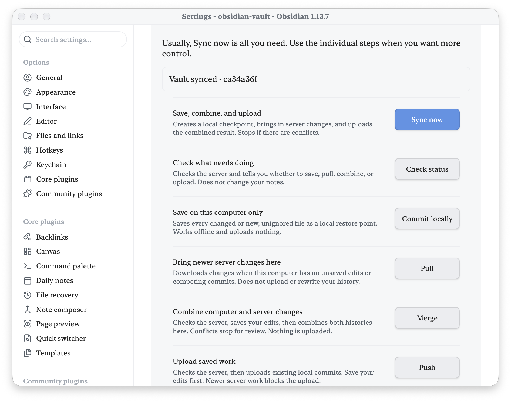

# Git Sync Desktop

An Obsidian plugin for synchronizing a vault with Git on **macOS, Windows, and
Linux**. Use the ribbon button or **Git Sync Desktop: Sync vault with Git**
in the command palette. It saves a local commit, merges server updates without
rebasing, uploads, and checks that the server and computer have the same commit.

This is the desktop companion to [VaultBridge](https://github.com/haivri/VaultBridge)
for iPhone. Both use your own repository. No VaultBridge service is required;
GitHub, Forgejo/Gitea, and other Git hosts work through your existing Git setup.
This plugin is distributed on GitHub and has not been submitted to the Obsidian
community directory.

## Features

- One-click sync from the ribbon or command palette.
- Separate Commit locally, Pull, Merge, and Push controls with plain-language explanations.
- Persistent progress, status, and failure feedback.
- Git LFS support and compatibility with your existing Git credentials and remote.
- Conflict checkpoints and explicit confirmation for advanced merge choices.
- Runs on macOS, Windows, and Linux; pairs with VaultBridge on iPhone.

## See it in action

### Manual Git tools

Save, pull, merge, and push with plain-language explanations and persistent sync feedback.

  

## Install

1. Install Git and Git LFS. On macOS, use `xcode-select --install` and Homebrew's
   `brew install git-lfs`. On Windows, install Git for Windows and Git LFS; on
   Linux, install `git` and `git-lfs` with your distribution's package manager.
   Run `git lfs install`. Ensure Git and Git LFS are on your system PATH, then
   restart Obsidian. Standard Homebrew paths are added automatically on macOS.
2. Configure Git identity and remote authentication in a terminal. The plugin
   uses Git's existing credentials; it does not store tokens.
3. Open a vault that is the root of its own Git repository, with an `origin`
   remote and a checked-out branch. The matching branch must exist on the server.
   Confirm you can fetch and push from a terminal first.
4. Download `main.js` and `manifest.json` from the
   [latest release](https://github.com/haivri/obsidian-git-sync-desktop/releases/latest).
   Also download `styles.css` and put all three files in `<vault>/.obsidian/plugins/git-sync-desktop/`. Alternatively, extract
   `git-sync-desktop.zip` into `<vault>/.obsidian/plugins/`.
5. Restart Obsidian, allow community plugins, and enable **Git Sync Desktop**.
6. Click the Git merge ribbon icon. Progress and any failure appear in Obsidian.

The plugin ID is now `git-sync-desktop` (previously `vault-git-sync`). Existing users should disable the old plugin, move its settings into the new plugin folder, enable Git Sync Desktop, and update any command hotkeys. Do not enable both copies. The repository includes `scripts/migrate-install.py` to preserve the old installation and migrate settings, enabled state, and hotkeys before installing the new runtime. Restart Obsidian after migrating. Existing Git checkpoint refs retain their original namespace so earlier recovery points remain available.
Version 1.2.0 includes the complete sync implementation; the former Mac-only
`Sync Obsidian Vault.command` script is no longer required by the plugin.
The plugin provides manual sync. An existing Mac watcher can continue running;
the legacy watcher and shortcut share its lock.

## Sync behavior

- All tracked changes and unignored new files are staged and committed.
  Configure `.gitignore` before syncing. Local commits remain safe if networking fails.
- Attachments use Git LFS hooks and filters. Staging failure stops before pull or push.
- Only one cooperating local sync runs at a time. Existing merge/rebase recovery
  states stop sync before staging. A forcibly stopped process can leave a lock;
  it is never removed automatically while another sync may still be running.
- Normal sync and merge leave conflicts visible for manual resolution. The explicit
  advanced force-merge action can prefer one side for conflicts. No force push, reset,
  or implicit autostash is performed.
- Mobile is excluded by the manifest and runtime guard. iPhone sync is handled
  by VaultBridge. A vault copied to Windows must use Windows-compatible filenames.

## Computer and iPhone setup

Use the same remote and branch in this plugin and VaultBridge. Sync before
switching devices, then sync the receiving device. Matching commits establish
agreement on the tracked Git tree; LFS attachments must also be downloaded.
Folder sizes can differ because Git history, LFS caches, ignored files, and
filesystem allocation are local to each device. Git sync does not replace backups.

## Troubleshooting

- **Git LFS required:** install Git LFS and retry. Do not disable filters to bypass
  an attachment error. Restart Obsidian after changing PATH on Windows or Linux.
- **Unfinished operation/conflicts:** preserve your work and finish recovery in
  a terminal. The plugin leaves recovery decisions to you.
- **Another sync running:** allow it to finish. After a crash, verify no sync
  process is active before removing the empty `sync.lock` directory under
  `~/Library/Application Support/ObsidianVaultSync` on macOS,
  `%LOCALAPPDATA%/ObsidianVaultSync` on Windows, or
  `${XDG_STATE_HOME:-~/.local/state}/ObsidianVaultSync` on Linux.
- **Authentication/network error:** fetch and push from a terminal to diagnose
  the connection. Interactive credential prompts are disabled inside Obsidian.

## Development and releases

No dependencies or transpilation are required. Run `npm run lint`, `npm test`,
and `npm run build`. Tests use temporary local Git repositories and mocked
Obsidian UI, never a real vault or remote account. CI runs the suite on macOS,
Windows, and Linux; check the Actions results for the release commit. Obsidian
UI testing is performed locally on macOS.

Publish the same clean source commit to private Forgejo and public GitHub, then
deploy runtime artifacts into each local vault while preserving `data.json`.
Tag releases with the manifest version (e.g. `1.2.0`) and attach `main.js`,
`manifest.json`, `styles.css`, and `git-sync-desktop.zip`. Never publish vault content, credentials,
or machine-specific configuration.

MIT licensed. This independently implemented plugin contains no VaultBridge
or GitSync.md application code.

## Manual Git tools (1.3.0)

Open **Settings → Git Sync Desktop → Manual Git actions**, or the command
**Open manual Git tools**. The ribbon still runs the familiar complete sync.
Every action shows live progress, a result, and actionable failure details.
Buttons are disabled while another operation is running.

| Button | What it does | Uploads? |
| --- | --- | --- |
| Check status | Fetches the latest server history and recommends the next step. Leaves note files unchanged. | No |
| Commit locally | Stages all unignored changes, including deletions, and saves a local checkpoint. Works without a remote. | No |
| Pull | Receives server changes only when local files are saved and there are no competing local commits. | No |
| Merge | Checks the server, saves local edits, protects the local commit, and combines both histories. Conflicts stop for review. | No |
| Push | Uploads existing saved commits after checking for newer server work. Does not commit unsaved edits. | Yes |
| Finish merge | Commits a merge after you resolve and stage conflicts in a Git client. | No |
| Sync now | Saves locally, merges server changes, then uploads and verifies. | Yes |

**Advanced → Force merge** opens a confirmation dialog. Choose whether the
computer or server wins conflicting text edits; Git retains non-conflicting
changes from both histories. For binary conflicts, Git selects the whole file
from that side. Some conflicts still require manual resolution. The action
never force-pushes, resets the vault, or bypasses an unfinished Git operation.

Manual Merge and Force merge protect the pre-merge local checkpoint under
`refs/vault-git-sync/checkpoints/` and display its short commit ID. These refs
keep the checkpoint reachable for recovery in a Git client. Server history is
also retained through the merge; nothing uploads until you choose Push.
If files keep changing while a checkpoint is being created, the action stops
so you can let editing settle and retry.

## Screenshot demo

A [ready-to-use screenshot kit](bootstrap/README.md) includes demo notes and capture instructions.

## Acknowledgements

Robert Fleming directed and reviewed this work. Recent refinements, documentation, and screenshot preparation were developed in collaboration with OpenAI Codex, powered by GPT-6. Thank you to the AI collaborators who helped bring these ideas into a usable community plugin.

## Feedback

Bug reports are welcome in this repository’s issue tracker when available. Include your Obsidian and plugin versions, desktop or mobile, a short reproduction, and expected versus actual behavior. Use a small sample note without personal content. This is a spare-time project; fixes and replies have no guaranteed schedule. Contributions and forks are welcome; donations are optional.
